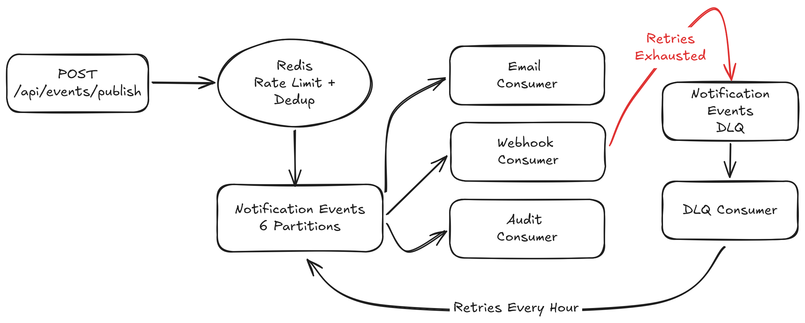

# NotifyFlow

Notification delivery in production systems requires async decoupling, retry resilience, and guaranteed delivery tracking, concerns that synchronous REST APIs can't address cleanly. NotifyFlow is a Kafka-based event pipeline that handles exactly this: routing business events through independent Email, Webhook, and Audit consumers at 24.5 events/second with p99 7ms latency, retry logic with exponential backoff, dead letter queue replay for permanent failures, and Redis-based rate limiting and deduplication.



```

## Tech Stack

| Layer | Technology |
|---|---|
| Language | Java 21 |
| Framework | Spring Boot 4.1.0 |
| Messaging | Apache Kafka 3.9.0 (KRaft mode) |
| Database | PostgreSQL 17 |
| Caching / Rate Limiting | Redis 7 |
| Testing | JUnit 5 + Mockito + Testcontainers — 89% instruction coverage |
| CI/CD | GitHub Actions |
| Documentation | Swagger UI / OpenAPI 3 |
| Build | Gradle |

---

## What It Does

NotifyFlow accepts business events (user signups, orders, payments, password resets) via a REST endpoint and routes them through a Kafka pipeline to three independent consumers:

- **Email Consumer** — simulates email delivery, logs to database
- **Webhook Consumer** — delivers to an external endpoint with exponential backoff retry and dead letter queue on exhaustion
- **Audit Consumer** — records every event for traceability and delivery tracking

The focus is the event-driven pipeline architecture itself — producers, consumers, consumer groups, partitioning strategy, retry mechanics, and failure handling — not building realistic upstream business systems.

---

## Features

- **Single Kafka topic** (`notification-events`, 6 partitions) with `userId` partition key — preserves per-user event ordering across all consumers
- **Typed event DTOs** via sealed interfaces and Java records — compile-time exhaustiveness checking on all consumer switch statements
- **Polymorphic HTTP deserialization** — single `POST /api/events/publish` endpoint accepts 4 typed event shapes via `@JsonTypeInfo`/`@JsonSubTypes`
- **Three independent consumer groups** — Email, Webhook, Audit each receive every event independently via Kafka's fan-out model
- **Exponential backoff retry** on webhook delivery (2s → 4s, max 3 attempts) via Spring Framework 7 native `@Retryable`
- **Dead Letter Queue** — failed webhook events published to `notification-events-dlq` after retry exhaustion, preserving them as replayable Kafka messages
- **Scheduled DLQ retry job** — `@Scheduled` service re-publishes failed DLQ events hourly, clearing per-consumer dedup keys to allow genuine retry attempts
- **Redis rate limiting** — atomic `INCR` + TTL window (10 requests/60s per user)
- **Redis deduplication** — namespaced `SETNX` keys per consumer group (24hr TTL), protecting against both client double-submit and Kafka at-least-once redelivery
- **`X-Idempotency-Key` header** — optional client-supplied UUID header; if provided, used as `eventId` so duplicate submissions are rejected with 409 rather than processed twice
- **Input validation** — `@Valid` + Jakarta constraint annotations (`@NotBlank`, `@Positive`) with field-level error messages via `@RestControllerAdvice`
- **MDC structured logging** — `eventId` and `eventType` injected into every log line via SLF4J MDC, enabling full event journey tracing across all consumers
- **Custom Micrometer metrics** — `notifyflow.events.published` counter + per-event-type breakdown via `eventType` tag, exposed via `/actuator/metrics`
- **Spring Actuator observability** — `/actuator/health` (Kafka, Postgres, Redis individually monitored), `/actuator/metrics`, `/actuator/info`
- **Subscription management** — REST API for users to opt in/out of notification types per channel
- **Structured error responses** — consistent `ErrorResponse` shape across all error paths via `@RestControllerAdvice`
- **Swagger UI** — interactive API documentation at `/swagger-ui.html`
- **GitHub Actions CI/CD** — automated test pipeline on every push to main

---

## Architecture Decisions

### Why Kafka over a simpler message queue (RabbitMQ, SQS)?
Out of many options, Kafka stood out the best as the industry relevant approach to event distribution that would be highly applicable and valuable for me to understand and use properly. The fanout behavior where all topic subscribed consumers receive messages independently rather than one message going to only one consumer (like the simpler message queue systems) makes it very easy to scale and is the big reason for its relevancy and therefore a great reason to learn. Message retention after consumption and offset reset behavior control are also some additional reasons why Kafka stood out as the better option that provides richer controls and support for additional features like dead letter queue replay which was implemented in this project.

### Why a single topic instead of one per event type?
Single topic was chosen for simplicity and tracking. Single `notification-events` topic with `eventType` included in the payload itself kept the consumer subscription model simple and meant the per user ordering could be preserved over all event types via the `userId` partition key. Scaling up with an additional event type is also simple, with just the addition of a new sealed interface subtype and record per event type. The downside of this choice is that additional complexity existed on the consumer's side as it needed to recognize and branch off based on `eventType` internally. Sealed interface `NotificationEvent` with record type events for each event was implemented to help enforce that the events arriving to the consumers are correct at the compiler level to help with consumer side event distinction.

### Why sealed interfaces and records for event DTOs?
Sealed interfaces and pattern matching switch statements made sure that all the necessary basics for event type support was implemented at compile time. It indeed helped catch some bugs during development and saved additional time and effort that could have been lost with unsealed interfaces and mutable variables causing interesting issues during testing. While all could have been fine if everything was operated how it should have, it felt like good practice and habit to develop to clarify the intention of objects (events should be permanent and read-only) and keep scope to minimum (sealed interfaces reinforcing that only currently existing events under it can implement) and was done so here.

### Why split `WebhookSenderService` out of `WebhookDeliveryConsumer`?
Spring Framework 7's `@Retryable` works via AOP proxying where the proxy catches calls coming from outside the bean it's been implemented in. The `@KafkaListener` method calling another method internally completely bypassed the proxy which made retrying not function. Therefore, the `WebhookSenderService` bean with retryable delivery logic had to be manually separated to have the proxy function correctly.

### Why namespaced Redis dedup keys per consumer group?
Consumer side dedup (`dedup:email:<eventId>`, `dedup:webhook:<eventId>`, `dedup:audit:<eventId>`), implemented for protection against Kafka's at least once delivery on consumer crash occasions, was implemented with the consumer name included in its key for dedup that's unique to the consumer as well as `eventId`. Implementation without the namespaced consumer included caused one consumer's dedup entry to incorrectly block other consumers from processing the same event, which the inclusion of the namespaced consumer dedup key solved nicely.

### Why exponential backoff over fixed retry delay?
A reason for requiring retries might be an overloaded downstream service which the fixed retry delay could potentially worsen. Exponential backoff, the default standard for backoff timing, was implemented instead to give the downstream service more recovery time in hopes of a successful retry. If retries are exhausted (3 retries), the webhook event will be published instead to dead letter queue for tracking, health monitoring, and replaying.

---

## API Overview


Full interactive documentation available at `/swagger-ui.html` when running locally.

### Event Publishing

| Method | Endpoint | Description |
|---|---|---|
| POST | `/api/events/publish` | Publish a notification event to the Kafka pipeline |

**Supported event types:** `USER_SIGNUP`, `ORDER_PLACED`, `PAYMENT_RECEIVED`, `PASSWORD_RESET`

**Rate limited:** 10 requests per 60 seconds per `userId`

**Example request:**
```json
{
    "eventType": "ORDER_PLACED",
    "userId": "user-123",
    "orderId": "ord-456",
    "orderTotal": 49.99
}
```

**Responses:** `202 Accepted` (async processing), `429 Too Many Requests` (rate limit), `409 Conflict` (duplicate), `400 Bad Request` (malformed body)

### Subscriptions

| Method | Endpoint | Description |
|---|---|---|
| POST | `/api/subscriptions` | Subscribe user to event type + channel |
| DELETE | `/api/subscriptions` | Unsubscribe user |
| GET | `/api/subscriptions/{userId}` | Get active subscriptions for user |

---

## Running Locally

### Prerequisites
- Java 21
- Docker Desktop
- Gradle (via wrapper — no install needed)

### Steps

```bash
# Clone the repository
git clone https://github.com/Froderic/notifyflow.git
cd notifyflow

# Start Kafka (KRaft), PostgreSQL, and Redis
docker compose up -d

# Run the application
./gradlew bootRun
```

Application starts on `http://localhost:8080`
Swagger UI: `http://localhost:8080/swagger-ui.html`

---

## Testing

```bash
./gradlew test
```

- **88% overall instruction coverage, 95% service layer** (JUnit 5 + Mockito + Testcontainers)
- **33 tests total** — integration tests, MockMvc controller tests, and service unit tests
- **Testcontainers integration tests** — real Postgres, Redis, and Confluent Kafka containers spin up automatically during test runs, no manual Docker setup required
- **MockMvc controller tests** — HTTP layer tested in isolation with mocked services, covering happy paths, rate limiting, deduplication, validation errors, and idempotency key handling
- Tests cover all 3 consumer pipelines, DLQ flow and retry job, rate limiting, deduplication, subscription service, input validation, and controller error responses

---

## CI/CD Pipeline

GitHub Actions runs on every push and pull request to `main`:

1. Spin up PostgreSQL 17 and Redis 7 containers
2. Set up JDK 21 (Temurin)
3. Build with Gradle
4. Run full test suite
5. Report pass/fail

Pipeline configuration: `.github/workflows/ci.yml`

---

## Deployment Architecture

See [DEPLOYMENT.md](DEPLOYMENT.md) for full AWS MSK deployment architecture and Railway alternative.

**Local development** uses Docker Compose with a single Kafka broker in KRaft mode. **Production design** targets AWS MSK (3-broker cluster across 3 Availability Zones), RDS PostgreSQL, and ElastiCache Redis — all in `ca-central-1`, private subnets, EC2 security group access only.

> **Note:** Free-tier deployment of NotifyFlow is constrained by its distributed architecture — running Kafka alongside PostgreSQL and Redis simultaneously requires either a paid managed Kafka service (AWS MSK, Confluent Cloud) or a VPS. Free platforms like Render are well-suited for single-service Spring Boot apps but not for Kafka-based pipelines. See [DEPLOYMENT.md](DEPLOYMENT.md) for the full AWS architecture design.

---

## Known Issues / Future Improvements

- Consumer-side dedup protects against Kafka redelivery but is not covered end-to-end by integration tests — tested separately via `EventDeduplicatorIntegrationTest`
- `MockWebhookController` is a dev fixture simulating a downstream webhook receiver — a real deployment would point at actual external endpoints
- Schema managed by Hibernate `ddl-auto: create-drop` in dev — production deployment would use Flyway migrations
- No frontend (intentional scope decision — backend portfolio focus)
- DLQ consumer currently simulates alerting via console log — production would integrate with PagerDuty, Slack, or similar